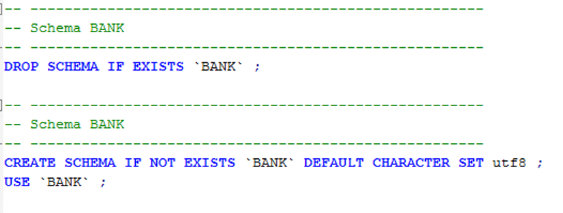
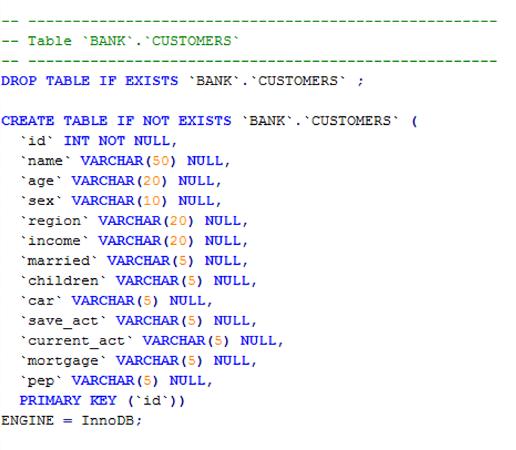
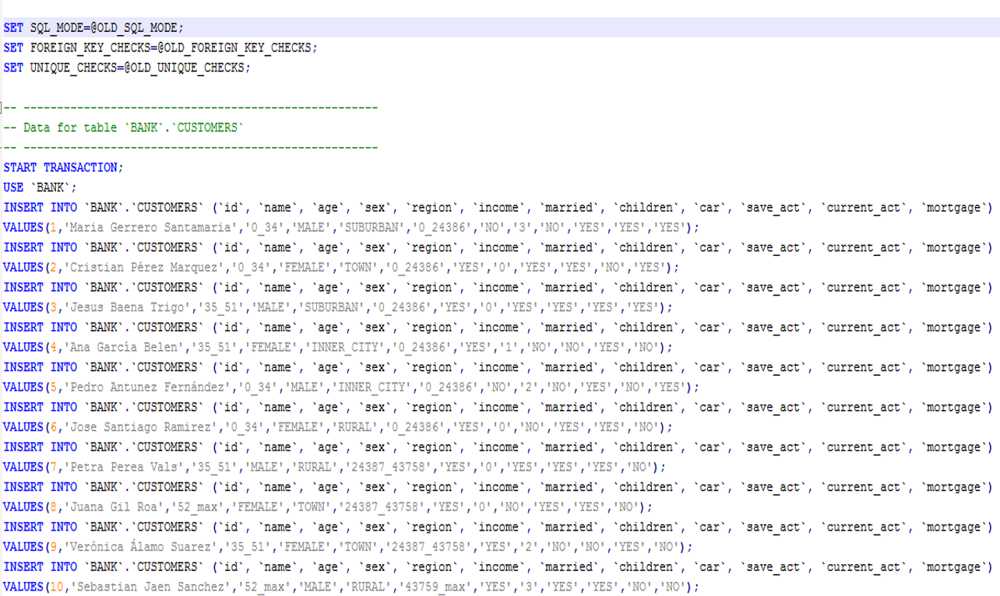
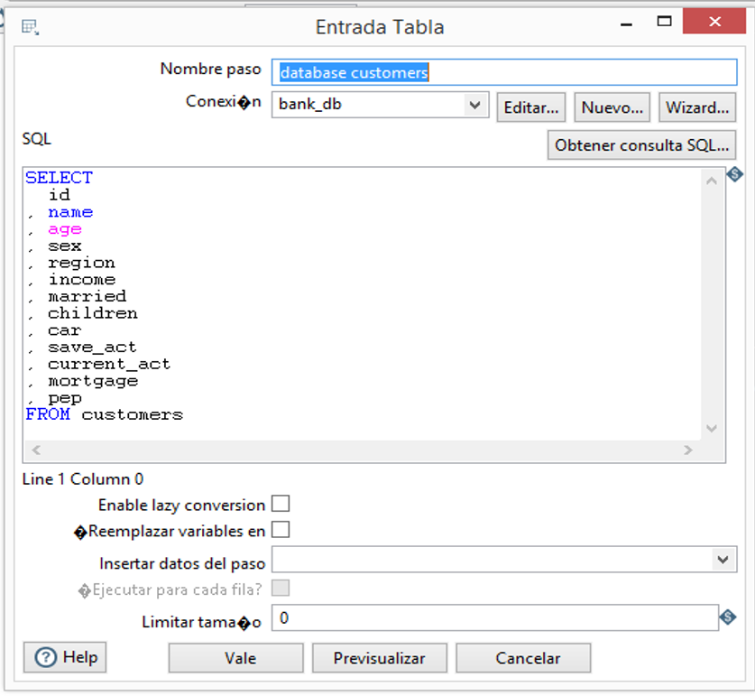
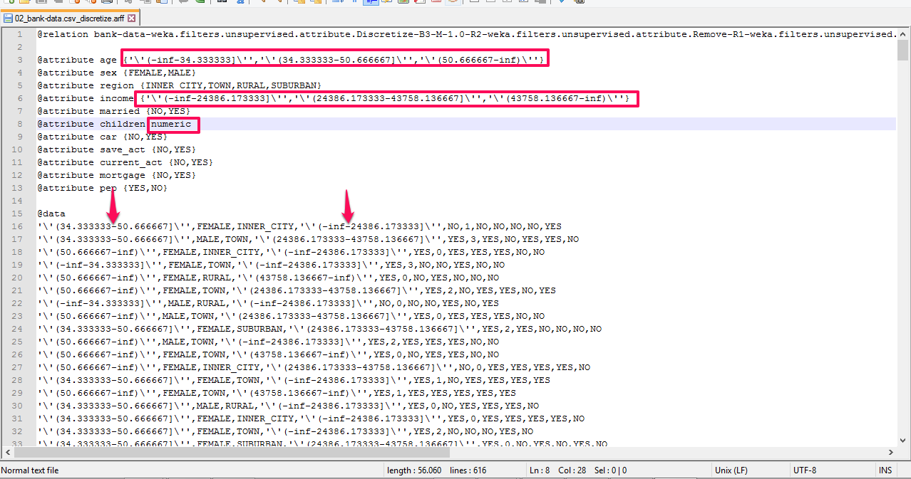

# Bloque 1: Lectura base de datos

Antes de realizar la lectura de la base de datos es necesario ejecutar el script customes.sql, este script realiza las siguientes acciones:

* Crea schema *BANK*




* Crea la tabla *CUSTOMERS*




* Inserta valores en los clientes en la base de datos



Una vez poblada la base de datos se podrá consultar usando kettle y el componente "Entrada tabla", paramétrizado como se muestra en la figura a continuación: 




# Bloque 2: Modelo predictivo 

El conjunto de datos data-bank consta de 600 observaciones y 12 variables, a continuación el significado de cada una:

* **id**:	identificador único
* **age**:	edad del cliente en años
* **sex**: sexo (MALE / FEMALE)
* **region**:	inner_city/rural/suburban/town
* **income**:	sueldo del cliente
* **married**:	está casado el cliente (YES/NO)
* **children**:	número de hijos del cliente
* **car**:	tiene el cliente coche propio (YES/NO)
* **save_acct**:	tiene el cliente cuenta de ahorro (YES/NO)
* **current_acct**:	tiene el cliente una cuenta corriente (YES/NO)
* **mortgage**:	tiene hipoteca el cliente (YES/NO)
* **pep**:	contratará el cliente un plan de inversión (YES/NO)

La variable objetivo es *pep*

```{r}
credit_approval = read.table(file="data/bank-data.csv", header=TRUE, sep=",", dec=".")
dim(credit_approval)
summary(credit_approval)
```

Para construir el modelo se han realizado las siguientes transformaciones:

## Filtrado de atributos

El atributo *id* no es de interés para el estudio, por ello lo eliminaremos


## Discretización




 

Transformaciones editando el fichero:

'\'(-inf-34.333333]\'' por 0_34

'\'(34.333333-50.666667]\''  por 35_51

'\'(50.666667-inf)\'' por 52_max

'\'(-inf-24386.173333]\'' por 0_24386


# Módulo 3: Filtrado


# Módulo 4: Salida
